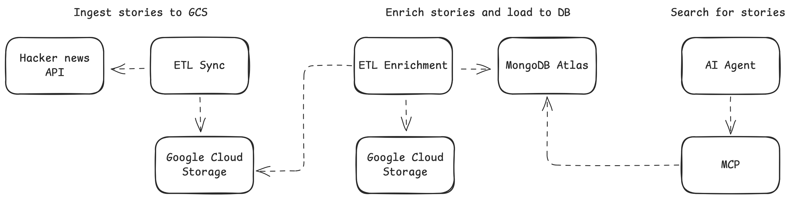

# Hacker News MCP Server

MCP server for AI agents to search Hacker News stories.

**Main components**

- ML search pipeline (ETL → enrichment → indexing → serving → evaluation)
- Hybrid search combining keyword + semantic embeddings (NDCG@5: 0.72, MRR 0.83)
- Custom LLM-powered evaluation framework for iterative improvement
- Serverless MCP server on Google Cloud Run

Tech: Python, FastMCP, MongoDB Atlas vector search, Custom evaluation framework, OpenAI embeddings, Docker, GCP

**Try it live**

Compatible with MCP-enabled clients (e.g., Augment, Claude Desktop).

```json
{
  "mcpServers": {
    "hacker-news-mcp": {
      "url": "https://hacker-news-mcp-632359460921.us-central1.run.app/mcp",
      "type": "http"
    }
  }
}
```

## Key Features

**High-level design**
- Hacker News API - Data source
- ETL pipelines:
    - Fetches new stories and stores in GCS
    - DAG workflow with 5 stages (pick → enrich → embed → combine → deploy)
- MongoDB Atlas - Keeps enriched stories with search indexes
- MCP Server - Search service with hybrid search logic
- AI Agents - End consumers



**Hybrid Search**
- Combined keyword matching + vector embeddings for better recall
- Weighted ranking by HN vote score (social validation) + recency

**Search Evaluation**
- Use custom eval framework (Precision@K, NDCG, MRR metrics)
- Generated synthetic query dataset using LLM-based ranking
- Iterative improvement through evaluation loops

[Read more about evaluation](docs/evaluation.md)

| Metric      | Score | What it measures                  |
|-------------|-------|-----------------------------------|
| Precision@5 | 0.72  | Accuracy of top 5 results         |
| NDCG@5      | 0.72  | Ranking quality                   |
| MRR         | 0.83  | Position of first relevant result |

**Infrastructure**
- Serverless deployment (Cloud Run)
- MongoDB Atlas for hybrid search indexes (text + vector)
- OpenAI embeddings for semantic search

**Repositories**
- ETL: https://github.com/vm-mishchenko/hacker-news-etl
- MCP Server: https://github.com/vm-mishchenko/hacker-news-mcp

## Development

**Setup**

```bash
# Clone repository
git clone https://github.com/vm-mishchenko/hacker-news-mcp.git
cd hacker-news-mcp

# Install dependencies
pip install -r requirements.txt

# Configure environment
cp .env.example .env.local
# Edit .env.local with your credentials
```

**Run Locally**

```bash
# Start MCP server (HTTP transport)
python -m src.server

# Debug with MCP Inspector
npx @modelcontextprotocol/inspector
# Connect to: http://localhost:8000/mcp

# Or use the Python client
python -m src.client
```

**Docker Build**

```bash
docker build -t hacker-news-mcp .
docker run -p 8000:8000 --env-file .env.local hacker-news-mcp
```

## Future Enhancements
- Comment search
- Dynamic re-ranking for top results
- Filters by date range or score threshold
